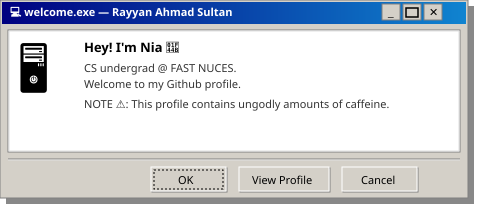

  

 

  <samp>
    <b>rayyan ahmad sultan</b> · nia · 21 · cs undergrad @ fast nuces
  </samp>

---

<samp><b>// languages & tools</b></samp>

  
  
  
  
  
  
  
  

 
---

<samp><b>// stats</b></samp>

 

  
   
  

  

 

---
 

  <samp>// reach out</samp>

  <a href="https://github.com/rayyan-41"><samp>github</samp></a>
   · 
  <a href="mailto:rayyanahmadsultan@email.com"><samp>email</samp></a>
   · 
  <a href="https://linkedin.com/in/niaaaa"><samp>linkedin</samp></a>

 

  <samp>⌨ built with frustration and ctrl+z · rayyan-41</samp>

